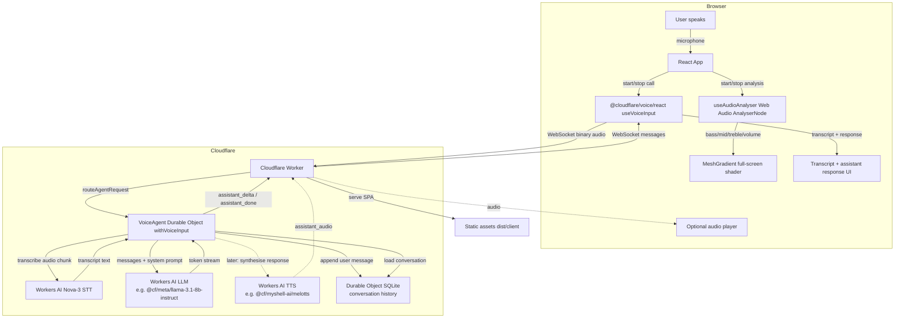

# Live Voice Assistant Architecture

A high-level view of the Cloudflare-native voice assistant flow.



## Data flow

1. The user clicks **Enable Voice**.
2. The React app starts two things in parallel:
   - `@cloudflare/voice/react` `useVoiceInput` opens a WebSocket to the Cloudflare Agent and streams microphone audio.
   - `useAudioAnalyser` creates a local `AnalyserNode` to derive bass, mid, treble, overall volume, brightness and centroid.
3. The Agent (`VoiceAgent`) receives the audio stream and runs it through Workers AI Nova-3 STT.
4. Finalised transcript chunks are appended to the `messages` table in the Durable Object's SQLite storage.
5. When the user finishes an utterance (stop click or silence detection), the Agent loads the conversation history and calls Workers AI LLM with a streaming request.
6. The LLM token stream is forwarded to the browser over the existing WebSocket and rendered in the UI.
7. The assistant message is stored in SQLite once complete, giving the conversation memory across sessions.
8. Static assets are served by the same Worker for the single-page app.

## Optional future phase: spoken responses

The agent response path can branch to Workers AI TTS:

```ts
if (voiceEnabled) {
  const audio = await env.AI.run("@cf/myshell-ai/melotts", { text: fullResponse });
  send({ type: "assistant_audio", audio });
}
```

This keeps TTS as a later toggle without changing the core text-first flow.

## Key files

| File                      | Responsibility                                          |
| ------------------------- | ------------------------------------------------------- |
| `src/index.ts`            | Worker entry point + `VoiceAgent` class + LLM/TTS calls |
| `src/routes/index.tsx`    | TanStack Start home route: React UI + shader            |
| `src/router.tsx`          | TanStack Router configuration                           |
| `src/routes/__root.tsx`   | TanStack Start root HTML shell                          |
| `src/useAudioAnalyser.ts` | Web Audio frequency analysis for visualisation          |
| `src/useAssistant.ts`     | New hook: consume assistant messages from agent         |
| `wrangler.jsonc`          | Worker config, AI binding, Durable Object binding       |
| `vite.config.ts`          | vite-plus + TanStack Start + Cloudflare plugin          |
