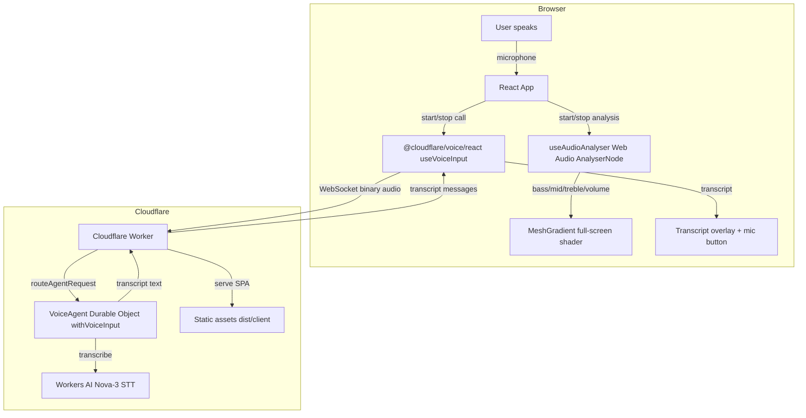

# Voice-to-Text Demo Architecture

A high-level view of how the demo is wired together.

## Data flow

1. The user clicks **Enable Voice**.
2. The React app starts two things in parallel:
   - `@cloudflare/voice/react` `useVoiceInput` opens a WebSocket to the Cloudflare Agent and streams microphone audio.
   - `useAudioAnalyser` creates a local `AnalyserNode` to derive bass, mid, treble, overall volume, brightness and centroid.
3. The Agent (`VoiceAgent`) receives the audio stream, runs it through Workers AI Nova-3 STT, and sends transcribed text back over the WebSocket.
4. The transcript is displayed in the bottom-left overlay.
5. The shader visualisation reacts to the smoothed audio features:
   - **distortion** → bass + overall volume
   - **swirl** → mid frequencies + volume
   - **speed** → treble + brightness + volume
   - **scale** → overall volume + bass (breathing/pulse)
   - **rotation** → fixed at 0
6. Static assets are served by the same Worker for the single-page app.

## Key files

| File                      | Responsibility                                    |
| ------------------------- | ------------------------------------------------- |
| `src/index.ts`            | Worker entry point + `VoiceAgent` class           |
| `src/routes/index.tsx`    | TanStack Start home route: React UI + shader      |
| `src/router.tsx`          | TanStack Router configuration                     |
| `src/routes/__root.tsx`   | TanStack Start root HTML shell                    |
| `src/useAudioAnalyser.ts` | Web Audio frequency analysis for visualisation    |
| `wrangler.jsonc`          | Worker config, AI binding, Durable Object binding |
| `vite.config.ts`          | vite-plus + TanStack Start + Cloudflare plugin    |
